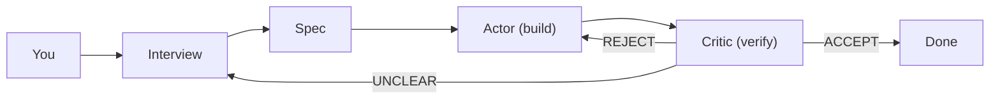

# specloop

[](LICENSE)

Spec-driven development on autopilot. Claude Code interviews you, writes the spec, builds it, verifies it, and loops until it's right.

## How it works



1. **Branch** — creates a feature branch from your main branch
2. **Interview** — Claude asks you questions to produce a detailed spec
3. **Actor** — Claude implements the spec autonomously (headless)
4. **Critic** — a separate Claude instance reviews the code against the spec with no actor context
5. **Loop** — repeats until the critic accepts, the spec needs clarification, or the loop stalls

The build-review loop is an [evaluator-optimizer](https://www.anthropic.com/engineering/building-effective-agents) workflow, closely related to [CEGIS](https://en.wikipedia.org/wiki/Counterexample-guided_abstraction_refinement) in program synthesis: the actor generates, the critic finds counterexamples, and failures drive refinement.

## Prerequisites

- [gum](https://github.com/charmbracelet/gum) — interactive prompts
- [glow](https://github.com/charmbracelet/glow) — terminal markdown rendering
- [Claude Code](https://docs.anthropic.com/en/docs/claude-code) — `npm install -g @anthropic-ai/claude-code`

## Install

```bash
git clone https://github.com/satyaborg/specloop.git
cd specloop
make install
```

Or just run it directly:

```bash
./specloop "add Stripe webhook handler"
```

## Usage

```bash
# basic — interview + build + review loop
specloop "add Stripe webhook handler"

# limit to 5 iterations, bail after 1 stall
specloop "add Stripe webhook handler" --max 5 --stall-limit 1

# skip interview, use a specific model
specloop "add Stripe webhook handler" --skip-interview --model claude-sonnet-4-5-20250929

# flags can go before or after the feature description
specloop --max 5 "add Stripe webhook handler"

# show help
specloop --help
```

## Configuration

Flags take precedence over environment variables. Environment variables take precedence over defaults.

| Flag | Env var | Default | Description |
|------|---------|---------|-------------|
| `--max` | `MAX` | `3` | Max build-review iterations |
| `--stall-limit` | `STALL_LIMIT` | `2` | Consecutive stalls before bailing |
| `--spec-dir` | `SPEC_DIR` | `specs` | Directory for spec artifacts |
| `--main-branch` | `MAIN_BRANCH` | `main` | Branch to diff against |
| `--skip-interview` | `SKIP_INTERVIEW` | `0` | Skip interview (spec must already exist) |
| `--model` | `MODEL` | *(default)* | Claude model override |

## Outputs

Each run produces artifacts in `specs/`:

| File | Contents |
|------|----------|
| `<slug>.md` | The spec |
| `<slug>-decisions.md` | Tradeoffs and resolved ambiguities |
| `<slug>-review.md` | Latest critic verdict |
| `<slug>-loop.log` | Full actor/critic output log |

## Exit codes

| Code | Meaning |
|------|---------|
| `0` | Accepted — critic approved the implementation |
| `1` | Needs human input — unclear spec or unresolved questions |
| `2` | Stalled — no progress after repeated iterations |

## Comparisons

| Tool | What it is | Spec phase | Build-review loop | Runs headless | Open source |
|------|-----------|------------|-------------------|---------------|-------------|
| **specloop** | CLI wrapping Claude Code | Interactive interview → spec | Actor builds, independent critic verifies, loops until accept | Yes | Yes |
| [Ralph Loop](https://github.com/frankbria/ralph-claude-code) | Standalone CLI wrapping Claude Code | Markdown files as persistent memory (goals, specs, progress) | Single agent; fresh context each iteration, reads file-based memory; no separate verifier | Yes | Yes |
| [Smart Ralph](https://github.com/tzachbon/smart-ralph) | Claude Code plugin | Five-phase spec pipeline (research → requirements → design → tasks → execution) | Self-contained loop with internal stop-hook (no Ralph dependency since v3.0) | Yes | Yes |
| [OpenSpec](https://github.com/Fission-AI/OpenSpec) | Lightweight SDD framework | Structured phases: proposal → specs → design → tasks | No autonomous loop — human drives each phase | No | Yes |
| [GitHub Spec Kit](https://github.com/github/spec-kit) | Spec templates + CLI | Constitution → Specify → Plan → Tasks → Implement (5 phases with quality gates) | No loop — human reviews between phases | No | Yes |
| [Kiro](https://kiro.dev/) | AWS agentic IDE (Code OSS fork) | Requirements → design → tasks (structured phases) | Agent hooks trigger on events; no explicit actor-critic loop | No | No (freemium) |
| [BMAD Method](https://github.com/bmad-code-org/BMAD-METHOD) | Multi-agent method | 21 specialized agents across full lifecycle | Agentic planning then context-engineered dev; no verifier loop | Partially | Yes |
| [Tessl](https://tessl.io/) | Agent enablement platform | Framework for specs + registry of 10k+ library specs | No autonomous loop — specs guide agents | No | Partially |
| [Aider](https://aider.chat/) (architect mode) | Terminal coding assistant | Architect model proposes, editor model implements | Two-model split but no independent critic; human reviews diffs | Partially | Yes |
| [Devin](https://devin.ai/) | Autonomous AI engineer | Takes tickets from Slack/Jira | Autonomous execution, submits PRs; no spec-first workflow | Yes | No |

**Key differentiator**: specloop is the only tool that combines an interactive interview phase with a fully autonomous actor-critic loop where the verifier has zero context from the builder — closer to [CEGIS](https://en.wikipedia.org/wiki/Counterexample-guided_abstraction_refinement) than a chat-based workflow.

## Why not a Claude Code plugin?

Claude Code plugins run inside a single session — one conversation context. That means if the actor and critic share a session, the critic has already seen the actor's reasoning before it starts reviewing. The review loses its teeth.

specloop spawns separate `claude -p` processes. The critic only sees the spec and the diff. It doesn't know why the actor made a decision, so it has to judge the code on its own merits. That isolation is load-bearing — without it, you're back to a single agent reviewing its own work. See [Human Review is the Bottleneck](https://satyaborg.com/blog/human-review-bottleneck) for more on why spec-based verification matters.

There are also practical reasons:

- `--dangerously-skip-permissions` is scoped to headless calls, not your whole session
- The loop manages git branches, state files, stall detection, and resume — things that don't fit in a slash command prompt
- It's a regular CLI: you can run it in CI, script it, or wrap it in other tools

## Security

The actor runs Claude Code with `--dangerously-skip-permissions`, giving it unrestricted shell access in your repo. Review the spec before the build phase starts, and run in repos you're comfortable with an AI modifying.

## License

[MIT](LICENSE)
